# RuralBus SaaS: Master Engineering & Development Plan

This document outlines the sequential, milestone-driven engineering roadmap for the **RuralBus** SaaS platform. All development follows a strict localhost-first methodology with zero external cloud dependencies required for local testing.

---

## 1. Roadmap Overview & MVP Boundary

```mermaid
gantt
    title RuralBus Engineering Roadmap (MVP vs Phase 2)
    dateFormat  X
    axisFormat %d
    section Core Infrastructure (Localhost)
    Phase 0 - Architecture & Sign-off     :active, p0, 0, 1
    Phase 1 - Monorepo & Local Docker Env  :p1, 1, 2
    Phase 2 - Fastify Backend Foundation   :p2, 2, 3
    Phase 3 - PostgreSQL & PostGIS Schema  :p3, 3, 4
    Phase 4 - Auth, JWT & RBAC Engine      :p4, 4, 5
    Phase 5 - Multi-Tenant RLS Engine      :p5, 5, 6
    section Application Foundations
    Phase 6 - Single React Native Mobile App:p6, 6, 7
    Phase 7 - React Admin Web Dashboard    :p7, 7, 8
    section Operational Domain Modules
    Phase 8 - Operator & Company Mgmt      :p8, 8, 9
    Phase 9 - Fleet, Route & Timetables    :p9, 9, 10
    Phase 10 - Driver Duty & Trip State    :p10, 10, 11
    section Real-Time & Ticketing Pipeline
    Phase 11 - WebSockets & Live GPS Hub   :p11, 11, 12
    Phase 12 - Passenger Search & Live Map :p12, 12, 13
    Phase 13 - ACID Seat Locking & Booking :p13, 13, 14
    Phase 14 - Razorpay Payment Pipeline   :p14, 14, 15
    Phase 15 - Offline QR Ticket Validation:p15, 15, 16
    section Verification & Hardening
    Phase 16 - Downsampled GPS Trajectory  :p16, 16, 17
    Phase 17 - Security & Performance Tests:p17, 17, 18
    Phase 18 - Localhost End-to-End Rehearsal:p18, 18, 19
    section Phase 2 (Future Roadmap)
    Phase 19 - Offline Cash Ticket Issuance:p19, 19, 20
    Phase 20 - Push Notifications (FCM)    :p20, 20, 21
```

---

## 2. Phase-by-Phase Execution Plan

### Phase 0: Architecture & Technical Planning (Current Review)
* **Goal**: Refine and freeze system architecture, multi-tenancy model, RLS connection pooling rules, and MVP boundaries.
* **Deliverables**:
  - `docs/architecture.md` (Revised)
  - `docs/development-plan.md` (Revised)
* **Verification**: User architectural sign-off before commencing Phase 1.

---

### Phase 1: Monorepo & Localhost Infrastructure Setup
* **Goal**: Initialize the Turborepo monorepo with `pnpm` workspaces, local Docker environment, shared TypeScript packages, and developer tooling.
* **Scope & Deliverables**:
  - `package.json`, `pnpm-workspace.yaml`, `turbo.json`
  - `packages/shared-types` (DTOs, Enums, UserRoles, Telemetry payloads)
  - `packages/shared-validators` (Zod / TypeBox validation schemas)
  - `packages/shared-config` (Base TSConfig, ESLint, Prettier presets)
  - `docker/docker-compose.yml` (`postgres:16-postgis` on port `5432`, `redis:7-alpine` on port `6379`)
  - Root `.env.example` with complete configuration keys
* **Verification**:
  - `docker compose up -d` boots healthy PostgreSQL and Redis containers.
  - `pnpm install` and `turbo run build` run successfully across all workspaces.

---

### Phase 2: Fastify Backend Foundation & Standardized Logging
* **Goal**: Scaffold the Fastify + TypeScript backend engine with structured error handling, configuration validation, and request logging.
* **Scope & Deliverables**:
  - `apps/api/src/server.ts`
  - `apps/api/src/config/env.ts` (Zod-validated environment config)
  - Pino structured logger with request correlation IDs (`req.id`)
  - Global error handler returning standardized API responses
  - Health check endpoints (`/health/live`, `/health/ready`)
* **Verification**:
  - Fastify server starts on `http://localhost:4000`.
  - Automated integration test verifies `/health/live` returning `200 OK`.

---

### Phase 3: PostgreSQL, PostGIS & Drizzle ORM Schema
* **Goal**: Declare database schema using Drizzle ORM with PostGIS spatial geometry support and migration workflows.
* **Scope & Deliverables**:
  - `packages/database/src/schema/`:
    - `users.ts`, `operators.ts`, `operator_members.ts`
    - `buses.ts`, `routes.ts`, `stops.ts`, `schedules.ts`, `trips.ts`
    - `bookings.ts`, `tickets.ts`, `trip_trajectories.ts`, `audit_logs.ts`
  - Drizzle Kit migration pipeline (`drizzle-kit generate` & `drizzle-kit migrate`)
  - Seed script generating sample operators, buses, stops, routes, and credentials.
* **Verification**:
  - Migrations apply cleanly on local PostgreSQL.
  - Spatial indexes verified with PostGIS query (`ST_DWithin`).

---

### Phase 4: Authentication, Token Rotation & Role-Based Access Control
* **Goal**: Implement secure authentication supporting multi-role access control, Argon2id hashing, short-lived JWTs, and Redis-backed refresh token rotation.
* **Scope & Deliverables**:
  - Password hashing via Argon2id.
  - JWT issuance (15-minute access token containing user ID and tenant ID if applicable).
  - Refresh token rotation stored with 30-day TTL in Redis.
  - Role-based authorization middleware (`requireRole(['PASSENGER', 'OPERATOR_ADMIN', ...])`).
  - Auth routes: `/api/v1/auth/login`, `/api/v1/auth/register`, `/api/v1/auth/refresh`, `/api/v1/auth/logout`, `/api/v1/auth/me`.
* **Verification**:
  - Test suite verifying login, token issuance, invalid token rejection, and token rotation.

---

### Phase 5: Multi-Tenant RLS & Transaction-Scoped Context
* **Goal**: Implement PostgreSQL Row-Level Security and Fastify tenant context middleware with connection-pool safety (`SET LOCAL`).
* **Scope & Deliverables**:
  - Database RLS policies on all multi-tenant tables.
  - Drizzle `withTenant(tenantId, callback)` transaction helper using parameterized `set_config('app.current_tenant_id', tenantId, true)`.
  - Fastify tenant extraction hook ensuring client-supplied tenant IDs are rejected.
  - Automated cross-tenant leak test verifying Tenant A cannot read/modify Tenant B records.
* **Verification**:
  - Automated test confirms queries executed without tenant context or with an unauthorized tenant ID return zero rows / fail.

---

### Phase 6: Single React Native Mobile App Foundation
* **Goal**: Scaffold the single React Native mobile application supporting Passenger, Driver, and Conductor roles via dynamic navigation.
* **Scope & Deliverables**:
  - `apps/mobile/` initialized with TypeScript and React Navigation.
  - Zustand auth store with secure persistent storage (MMKV).
  - Dynamic Root Navigator switching between `AuthNavigator`, `PassengerNavigator`, `DriverNavigator`, and `ConductorNavigator` based strictly on backend JWT claims.
  - Shared UI theme, design tokens, and networking client.
* **Verification**:
  - Launch app locally. Logging in with Driver credentials loads Driver HUD; Passenger credentials loads Passenger interface.

---

### Phase 7: React Admin Web Dashboard Foundation
* **Goal**: Scaffold the React + Vite + TypeScript web dashboard for transport operators.
* **Scope & Deliverables**:
  - `apps/admin/` with responsive layout (Sidebar, Header, Breadcrumbs).
  - TanStack Query (React Query) setup with typed API client.
  - Protected route guards checking `OPERATOR_ADMIN` role.
  - Tenant session switcher and profile manager.
* **Verification**:
  - Launch Vite dev server on `http://localhost:5173`. Authenticate as Operator Admin and verify dashboard renders.

---

### Phase 8: Operator & Staff Management
* **Goal**: Backend endpoints and Admin UI for company profile management and staff (Driver / Conductor) provisioning.
* **Scope & Deliverables**:
  - Operator CRUD API (`/api/v1/operators/*`) and staff management endpoints (`/api/v1/operator/staff/*`).
  - Admin UI for viewing company details, inviting drivers and conductors, and resetting credentials.
* **Verification**:
  - Operator Admin creates a new Driver and Conductor; staff credentials can successfully log into the mobile app.

---

### Phase 9: Fleet, Route, Stop & Timetable Scheduling
* **Goal**: Bus management, interactive route builder with geo-fenced stops, and timetable trip dispatching.
* **Scope & Deliverables**:
  - Bus CRUD API (registration, seat capacity, seating layout).
  - Interactive Route Builder on Admin Web (canvas for placing stops and generating route polylines).
  - Timetable Schedule Dispatcher: Create recurring schedules, assign Bus + Driver + Conductor.
* **Verification**:
  - Create route with 5 stops, generate a polyline, and dispatch a daily trip.

---

### Phase 10: Driver & Conductor Mode Foundations
* **Goal**: Mobile workflows for driver duty execution and conductor passenger manifest review.
* **Scope & Deliverables**:
  - Driver UI: View assigned trips, "Start Trip" / "End Trip" state machine.
  - Conductor UI: Passenger manifest view, real-time boarding status, occupancy counter.
* **Verification**:
  - Driver starts trip; conductor manifest updates state in real-time.

---

### Phase 11: Real-Time GPS Telemetry & WebSockets Hub
* **Goal**: High-throughput GPS telemetry pipeline streaming live bus locations to passengers and admin radar via Redis.
* **Scope & Deliverables**:
  - Fastify WebSocket server (`/ws/tracking`).
  - Driver mobile background location streamer with throttling (every 3s) and dead-zone FIFO buffer.
  - Redis Pub/Sub channel routing (`channel:trip:<tripId>`) and Redis Geospatial index (`GEOADD active_fleet:<tenantId>`).
  - Admin Live Fleet Radar map rendering moving buses in real time.
* **Verification**:
  - Emitting simulated GPS coordinates updates both Admin Radar and Passenger screens in <1s.

---

### Phase 12: Passenger Route Discovery & Live Bus Tracking
* **Goal**: Passenger portal to search routes between stops, view timetables, and track upcoming buses.
* **Scope & Deliverables**:
  - Spatial Route Search API (`GET /api/v1/routes/search?originStop=&destStop=`).
  - Passenger Mobile Map: Live bus marker with ETA calculation and route polyline display.
* **Verification**:
  - Search from Stop A to Stop B; verify returning available trips with live bus ETA.

---

### Phase 13: Authoritative Seat-Locking & Booking Engine
* **Goal**: PostgreSQL ACID booking engine with Redis fast-path hold preventing double-booking.
* **Scope & Deliverables**:
  - Interactive Seat Grid component in Mobile App.
  - PostgreSQL transaction-backed seat hold with `locked_until = NOW() + INTERVAL '5 minutes'`.
  - Database Unique Partial Index: `UNIQUE (trip_id, seat_number) WHERE status IN ('HELD', 'CONFIRMED')`.
  - Redis fast-path pre-check key (`hold:trip:<tripId>:seat:<num>`).
* **Verification**:
  - Two concurrent client requests for the same seat result in exactly one successful lock and one `409 Conflict`.

---

### Phase 14: Razorpay Payment Pipeline & Webhook Reconciliation
* **Goal**: End-to-end payment lifecycle with Razorpay Orders API, client checkout, and webhook verification.
* **Scope & Deliverables**:
  - Razorpay backend adapter (`createOrder`, `verifySignature`, mock mode for local dev).
  - Mobile Razorpay Checkout modal.
  - Webhook endpoint (`POST /api/v1/payments/webhook`) with HMAC SHA256 cryptographic verification.
* **Verification**:
  - Complete simulated test payment; booking automatically confirms and generates digital ticket.

---

### Phase 15: Digital Tickets & Conductor Offline QR Validation (MVP)
* **Goal**: Cryptographically signed digital ticket generation and offline camera QR code validation for conductors.
* **Scope & Deliverables**:
  - Digital ticket generator issuing Ed25519 / JWS signed payloads.
  - Passenger Ticket Wallet displaying dynamic QR codes.
  - Conductor pre-departure manifest download into local SQLite/MMKV.
  - Conductor camera scanner verifying QR signatures and preventing duplicate boarding scans offline.
* **Verification**:
  - Disconnect conductor device from network, scan passenger QR ticket, verify instant offline validation and boarding status update.

---

### Phase 16: Downsampled GPS Trajectory Storage
* **Goal**: Background worker reading telemetry stream buffer and saving compressed PostGIS `LineString` at trip completion.
* **Scope & Deliverables**:
  - Redis Stream telemetry buffer (`stream:gps:<tripId>`).
  - Trajectory simplification worker applying Ramer-Douglas-Peucker (RDP) algorithm.
  - Final insertion into PostgreSQL `trip_trajectories` table as single geometry record.
* **Verification**:
  - Complete a simulated 30-minute trip (600 raw pings); verify exactly 1 compressed `LineString` row is saved in PostgreSQL.

---

### Phase 17: Security, Rate Limiting & Performance Hardening
* **Goal**: Comprehensive automated testing, rate limiting, and database indexing optimizations.
* **Scope & Deliverables**:
  - End-to-end integration test suite covering auth, booking, RLS, and tracking.
  - Fastify rate limiters on auth, booking, and WebSocket endpoints.
  - SQL index optimization and connection pool tuning.
* **Verification**:
  - 100% passing test suites; zero cross-tenant leaks under concurrent load.

---

### Phase 18: Localhost End-to-End Rehearsal
* **Goal**: Full simulated end-to-end rehearsal of the entire transportation ecosystem on localhost.
* **Scope & Deliverables**:
  - Complete multi-user simulation script:
    1. Operator creates route & schedules trip on Admin Web.
    2. Driver logs into Mobile App, starts trip, streams GPS.
    3. Passenger discovers route, locks seat, completes payment, receives QR ticket.
    4. Conductor downloads manifest, scans passenger QR offline, validates boarding.
    5. Driver ends trip; historical trajectory compresses to PostGIS.
* **Verification**: Complete multi-user workflow runs seamlessly on local machine.

---

## 3. Phase 2 (Future Roadmap - Post-MVP)

### Phase 19: Offline Cash Ticket Issuance & Financial Reconciliation
* **Scope**:
  - Monotonic composite sequence generator: `TKT-<OPERATOR>-<DEVICE>-<TRIP>-<SEQ>`.
  - Device identity registration and cryptographic hash chaining per offline ticket.
  - Post-trip transactional batch sync (`/offline-tickets/sync`).
  - Cash settlement reports and depot reconciliation dashboard.

### Phase 20: Push Notifications & Multi-Operator Advanced Features
* **Scope**:
  - Firebase Cloud Messaging (FCM) production push alert pipeline.
  - SMS OTP gateway adapter.
  - Multi-operator pooled route discovery and revenue split settlement.
  - Native Bluetooth POS thermal ticket printer support for conductors.
